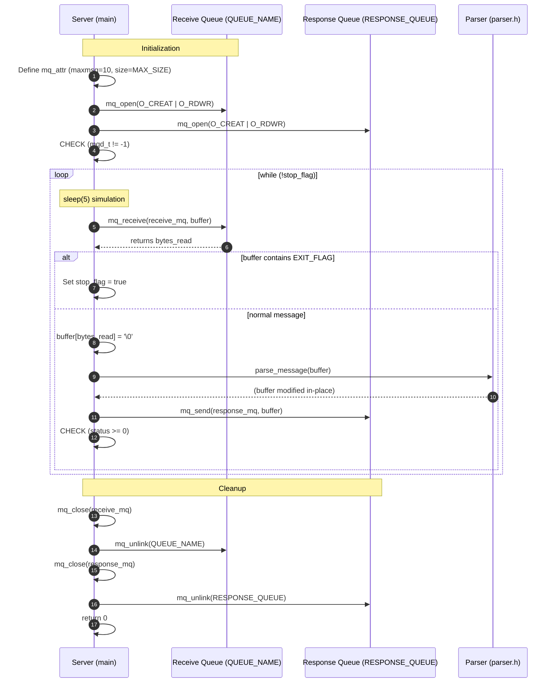

```mermaid
sequenceDiagram
    autonumber
    participant S as Server (main)
    participant RQ as Receive Queue (QUEUE_NAME)
    participant PQ as Response Queue (RESPONSE_QUEUE)
    participant P as Parser (parser.h)

    Note over S,RQ: Initialization
    S->>S: Define mq_attr (maxmsg=10, size=MAX_SIZE)
    S->>RQ: mq_open(O_CREAT | O_RDWR)
    S->>PQ: mq_open(O_CREAT | O_RDWR)
    S->>S: CHECK (mqd_t != -1)

    loop while (!stop_flag)
        Note over S: sleep(5) simulation
        S->>RQ: mq_receive(receive_mq, buffer)
        RQ-->>S: returns bytes_read
        
        alt buffer contains EXIT_FLAG
            S->>S: Set stop_flag = true
        else normal message
            S->>S: buffer[bytes_read] = '\0'
            S->>P: parse_message(buffer)
            P-->>S: (buffer modified in-place)
            S->>PQ: mq_send(response_mq, buffer)
            S->>S: CHECK (status >= 0)
        end
    end

    Note over S,PQ: Cleanup
    S->>S: mq_close(receive_mq)
    S->>RQ: mq_unlink(QUEUE_NAME)
    S->>S: mq_close(response_mq)
    S->>PQ: mq_unlink(RESPONSE_QUEUE)
    S->>S: return 0
```
